# Cushion Sense

**Smart Pressure Monitoring Cushion for Pressure Ulcer Prevention in Wheelchair Users**

## สมาชิกในกลุ่มและบทบาทหน้าที่

- 6704035616161 นางสาวกานต์ธิดา เพียรไพโรจน์ รับผิดชอบส่วนออกแบบ UI/UX
- 6704035617116 นายภัคพล โสภา รับผิดชอบส่วน Software
- 6704035617159 นางสาวภิญญดา สายใจ รับผิดชอบส่วน Hardware
- 6704035617183 นางสาวกัลยวรรธน์ ชนะสงคราม รับผิดชอบส่วน Software

## ปัญหาและแรงจูงใจ

### ปัญหา

**ความเสี่ยงของแผลกดทับ :** สำหรับผู้สูงอายุ ผู้ป่วยติดเตียง หรือผู้ที่ต้องนั่งรถเข็นเป็นเวลานาน การนั่งอยู่ในท่าเดิมนานเกินไปโดยไม่รู้ตัว จะทำให้เกิดแรงกดทับสะสมจนกลายเป็นแผลกดทับ ซึ่งรักษาได้ยากและมีค่าใช้จ่ายสูง และการนั่งทับเป็นเวลานานมักเกิดความอับชื้น เหงื่อออก หรือสะสมความร้อน ซึ่งเป็นตัวเร่งสำคัญทำให้ผิวหนังเปื่อยยุ่ยและเกิดแผลได้ง่ายขึ้น

**ข้อจำกัดในการดูแลของผู้ดูแล :** ผู้ดูแลไม่สามารถเฝ้าระวังท่านั่ง การขยับตัว หรือสภาพแวดล้อมบนเบาะได้ตลอด 24 ชั่วโมง บางครั้งผู้ป่วยนั่งเอียงหรือทิ้งน้ำหนักผิดท่าโดยที่ไม่มีใครสังเกตเห็น

### แรงจูงใจ

**เพื่อยกระดับคุณภาพชีวิตและความปลอดภัย :** ต้องการสร้างเครื่องมืออัจฉริยะที่ทำหน้าที่เสมือน ผู้ช่วยเฝ้าระวังส่วนตัว คอยเตือนให้ผู้ป่วยขยับเปลี่ยนท่านั่ง เพื่อป้องกันการเกิดแผลกดทับตั้งแต่การเกิด

**เพื่อลดภาระและสร้างความอุ่นใจให้ผู้ดูแล :** มีระบบแจ้งเตือนภัยล่วงหน้า (Alarm Alert) ทั้งกรณีความชื้นสูงหรืออุณหภูมิสูงรวมถึงแจ้งเตือนด้วยเสียง เมื่อถึงเวลาต้องขยับตัว ช่วยให้ผู้ดูแลไม่ต้องคอยกังวลตลอดเวลา

## ฟีเจอร์หลักและฟีเจอร์ขั้นสูงของแอป

### ฟีเจอร์หลักของแอป

แอปพลิเคชัน Cushion Sense สามารถแสดงข้อมูลการใช้งานเบาะรองนั่งแบบเรียลไทม์ (Real-time Monitoring) ได้แก่ สถานะการใช้งาน ระยะเวลาการนั่ง อุณหภูมิ ความชื้น และตำแหน่งของแรงกด พร้อมระบบแจ้งเตือน (Alert Manager) เมื่อพบเหตุการณ์ที่ควรเฝ้าระวัง เช่น การนั่งเป็นเวลานาน แรงกดที่ไม่สมดุลระหว่างด้านซ้ายและด้านขวา หรืออุณหภูมิและความชื้นสูงเกินค่าที่กำหนด นอกจากนี้ ผู้ใช้งานยังสามารถเรียกดูข้อมูลย้อนหลังและติดตามแนวโน้มของข้อมูลผ่านหน้า Dashboard เพื่อช่วยเฝ้าระวังพฤติกรรมการนั่งและสนับสนุนการประเมินความเสี่ยงต่อการเกิดแผลกดทับเบื้องต้น

### ฟีเจอร์ขั้นสูงของแอป

**_Data and Storage_**

- **Firebase / Supabase / cloud database**

พัฒนาระบบฐานข้อมูลบน Cloud โดยใช้ Supabase เป็น Backend สำหรับจัดเก็บและจัดการข้อมูลที่เกี่ยวข้องกับการใช้งาน Cushion Sense ได้แก่ ข้อมูลบัญชีผู้ใช้ ข้อมูลผู้ป่วย และข้อมูลการตรวจวัดจากเซนเซอร์ ระบบจะเชื่อมต่อแอปพลิเคชันกับ Supabase เพื่อรองรับการบันทึกข้อมูล การเรียกดูข้อมูลย้อนหลัง และการเชื่อมโยงข้อมูลกับผู้ใช้หรือรอบการใช้งานเบาะแต่ละครั้ง โดยกำหนดโครงสร้างข้อมูลให้มีความสัมพันธ์อย่างเหมาะสม พร้อมบันทึกวันและเวลาที่เกิดรายการ

- **Local persistent storage เช่น AsyncStorage / SQLite**

ระบบใช้ AsyncStorage ในการจัดเก็บและเรียกคืนข้อมูลอ้างอิงของผู้ป่วยที่เลือกไว้บนอุปกรณ์เพื่อให้แอปสามารถนำข้อมูลผู้ป่วยดังกล่าวมาใช้ประกอบการบันทึกประวัติได้ นอกจากนี้ ระบบเชื่อมต่อกับ Supabase เพื่อบันทึกข้อมูลเซนเซอร์และผลการประมวลผลลงในตาราง sensor_history ซึ่งประกอบด้วยข้อมูลแรงกด อุณหภูมิ ความชื้น ตำแหน่งการนั่ง และสถานะการแจ้งเตือน ช่วยให้สามารถจัดเก็บและเรียกดูประวัติการติดตามผู้ป่วยย้อนหลังได้

- **Patient/session history**

พัฒนาระบบจัดเก็บและเรียกดูประวัติการใช้งานเบาะ โดยบันทึกข้อมูลการตรวจวัดจากเซนเซอร์และเหตุการณ์แจ้งเตือนลงในฐานข้อมูล Supabase ข้อมูลที่จัดเก็บประกอบด้วยค่าแรงกด อุณหภูมิ ความชื้น วันและเวลาที่ตรวจวัด ระบบจะจัดกลุ่มข้อมูลตามผู้ป่วยและรอบการใช้งาน (Session) เพื่อให้สามารถเรียกดูข้อมูลย้อนหลังตามช่วงเวลาที่ต้องการ และตรวจสอบการเปลี่ยนแปลงของค่าที่ตรวจวัดได้

**_Sensor_**

- **Real-time Sensor Monitoring**

พัฒนาระบบเชื่อมต่อระหว่าง ESP32 กับแอปพลิเคชัน Cushion Sense เพื่อรับข้อมูลจากเซนเซอร์และแสดงผลบนหน้าจอ โดยข้อมูลที่ตรวจวัดประกอบด้วยแรงกด อุณหภูมิ และความชื้นตามเซนเซอร์ที่ติดตั้งในต้นแบบ
ระบบจะแสดงค่าที่ตรวจวัดได้ล่าสุด พร้อมสถานะการใช้งานและเวลาในการรับข้อมูล เพื่อให้ผู้ใช้หรือผู้ดูแลสามารถติดตามการเปลี่ยนแปลงของข้อมูลได้อย่างต่อเนื่อง

- **Threshold Alert (Pressure and Temperature Alerts)**

พัฒนาระบบแจ้งเตือนเมื่อข้อมูลจากเซนเซอร์มีค่าเกินเกณฑ์ที่กำหนด (Threshold Alert) โดยระบบจะรับข้อมูลจากเซนเซอร์ผ่าน ESP32 และนำมาตรวจสอบกับเงื่อนไขที่กำหนดไว้ เพื่อแสดงสถานะและแจ้งเตือนให้ผู้ใช้หรือผู้ดูแลทราบเมื่อพบข้อมูลที่ควรเฝ้าระวัง โดยจะเน้นการตรวจสอบค่าแรงกด อุณหภูมิ และความชื้นบริเวณเบาะ

**_UI/UX_**

- **Triage-style Workflow Without Medical Diagnosis**

พัฒนากระบวนการนำเสนอข้อมูลและสถานะการเฝ้าระวังในลักษณะ Triage-style Workflow เพื่อช่วยให้ผู้ใช้หรือผู้ดูแลสามารถแยกระดับความเร่งด่วนในการตรวจสอบข้อมูลจากเซนเซอร์ได้อย่างเป็นระบบ โดยไม่ทำหน้าที่วินิจฉัยโรคหรือประเมินแทนบุคลากรทางการแพทย์ ระบบจะประมวลผลข้อมูลแรงกด อุณหภูมิ และความชื้นร่วมกับเงื่อนไขการแจ้งเตือนที่กำหนดไว้ แล้วแสดงสถานะเพื่อแนะนำขั้นตอนการดำเนินการเบื้องต้น

## แผนภาพสถาปัตยกรรมของระบบ

```text
cushion-app-54
│
├── Unauthenticated
│   ├── Welcome / Splash Screen
│   └── Login Screen
│
└── Authenticated
    └── Tab Navigation
        ├── Home
        ├── History
        ├── Lists
        └── Profile
```

### Related Files

| Screen / Component      | File Path                |
| ----------------------- | ------------------------ |
| Root Stack              | `app/_layout.tsx`        |
| Welcome / Splash Screen | `app/index.tsx`          |
| Login                   | `app/login.tsx`          |
| Tab Navigation          | `app/(tabs)/_layout.tsx` |
| Home                    | `app/(tabs)/index.tsx`   |
| History                 | `app/(tabs)/history.tsx` |
| Lists                   | `app/(tabs)/lists.tsx`   |
| Profile                 | `app/(tabs)/profile.tsx` |

## ขั้นตอนการติดตั้ง

**1. Clone Project**

```bash
git clone https://github.com/plengpleng1/cushion-app-54.git
```

เข้าสู่โฟลเดอร์โปรเจกต์

```bash
cd cushion-app-54
```

**2. ติดตั้ง Dependencies**

```bash
npm install
```

**3. เริ่มต้นโปรเจกต์**

```bash
npx expo start
```

## วิธีรันแอป

หลังจากใช้คำสั่ง

```bash
npx expo start
```

จะสามารถเลือกวิธีเปิดแอปได้ เช่น

```bash
กด w  → เปิด Web
กด a  → เปิด Android
กด i  → เปิด iOS
สแกน QR Code → เปิดผ่าน Expo Go
```

## การตั้งค่า API / ฐานข้อมูล / AI / เซนเซอร์

ระบบมีการเชื่อมต่อ API ผ่าน Google Apps Script เพื่อดึงข้อมูลจาก Google Sheets มาแสดงผลบนแอปพลิเคชัน Cushion Sense โดยใช้ Supabase เป็นฐานข้อมูลสำหรับจัดเก็บประวัติข้อมูลเซนเซอร์และข้อมูลที่ผ่านการประมวลผล ขณะที่เซนเซอร์ที่เชื่อมต่อกับ ESP32 ทำหน้าที่ตรวจวัดแรงกด อุณหภูมิ และความชื้น เพื่อนำข้อมูลมาวิเคราะห์ตำแหน่งการนั่ง ระยะเวลาการนั่ง และตรวจสอบค่าเทียบกับเกณฑ์ที่กำหนด เพื่อแจ้งเตือนเมื่อพบสถานการณ์ที่ควรเฝ้าระวัง

## ภาพหน้าจอ

- **หน้า Sign In**
<p align="left">
  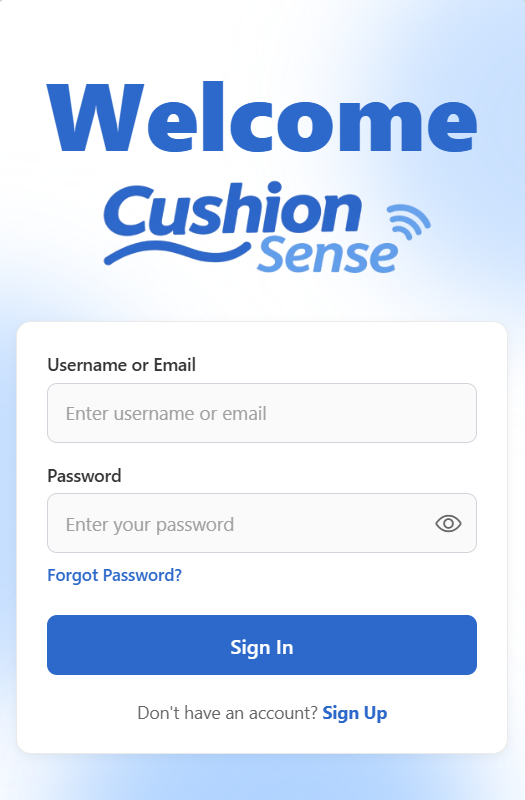 &nbsp;&nbsp;&nbsp;&nbsp;
  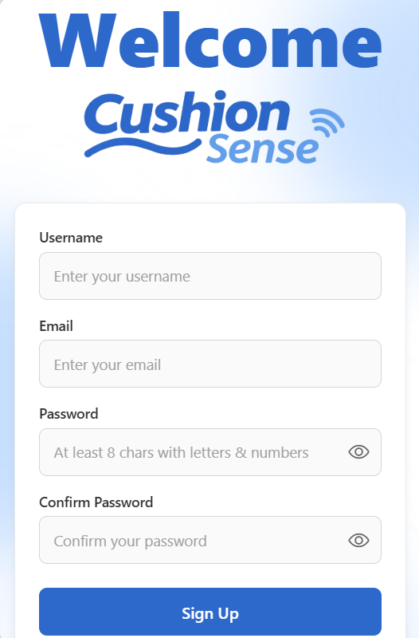 &nbsp;&nbsp;&nbsp;&nbsp;
  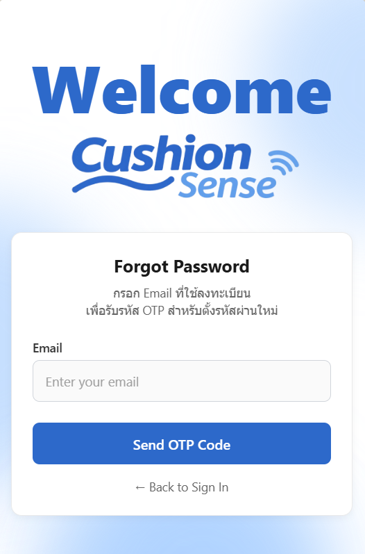
</p>

- **หน้า Select Patient**
<p align="left">
  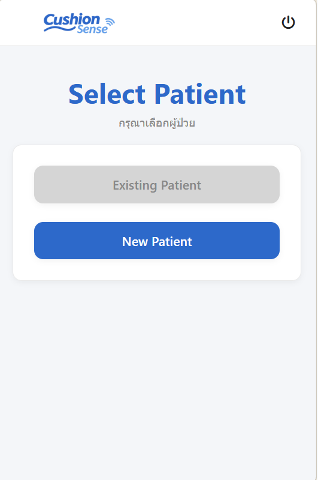 &nbsp;&nbsp;&nbsp;&nbsp;
  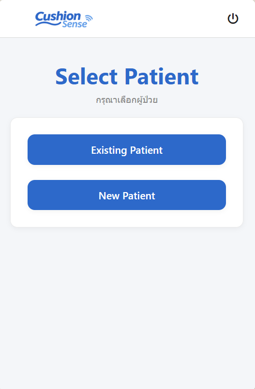 
</p>

- **หน้า Existing & New Patient**
<p align="left">
  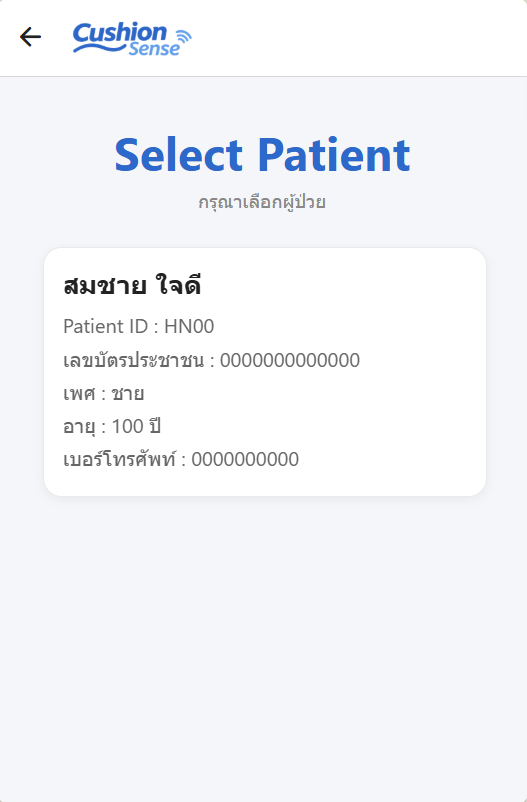 &nbsp;&nbsp;&nbsp;&nbsp;
  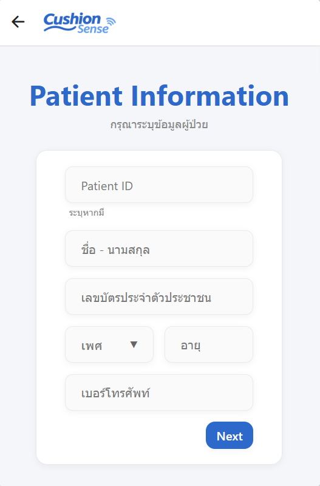 
</p>

- **หน้า Home**
<p align="left">
  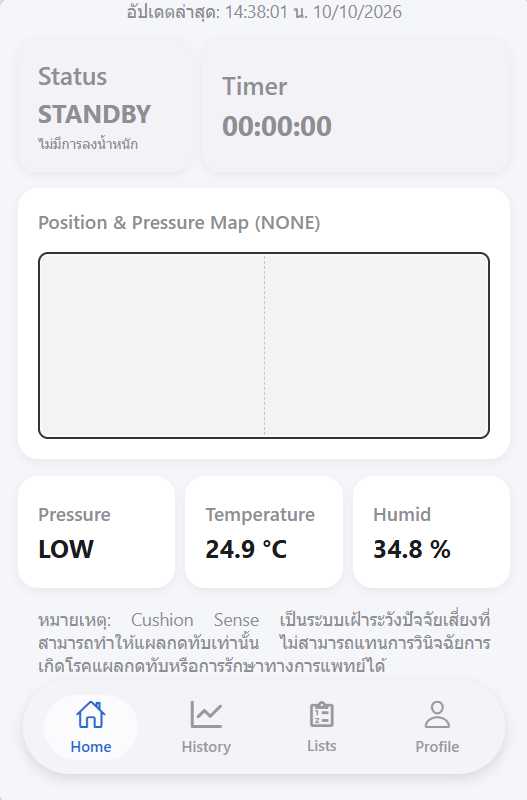 
</p>

- **หน้า History**
<p align="left">
  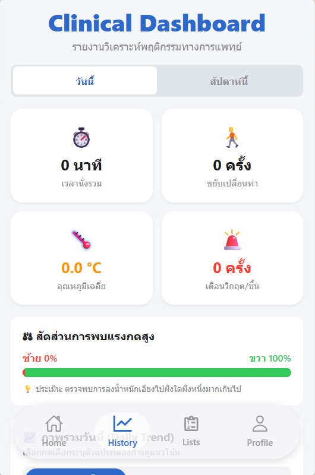 &nbsp;&nbsp;&nbsp;&nbsp;
  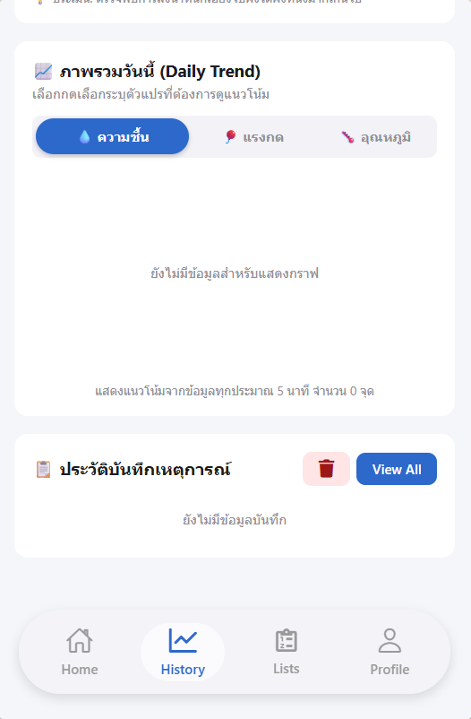 
</p>

- **หน้า Patient Lists**
<p align="left">
  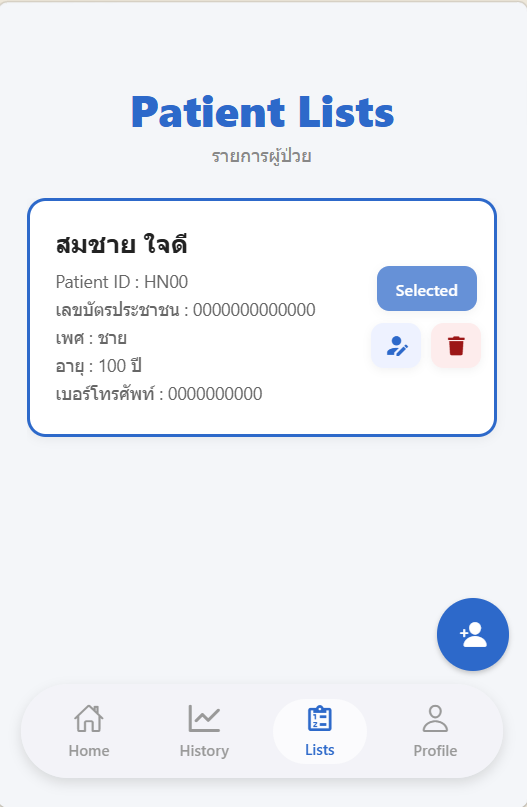 &nbsp;&nbsp;&nbsp;&nbsp;
  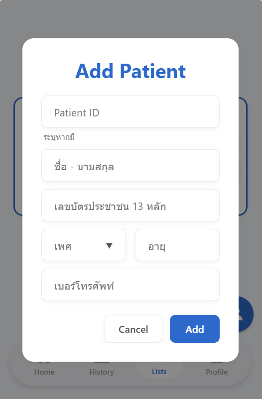 &nbsp;&nbsp;&nbsp;&nbsp;
  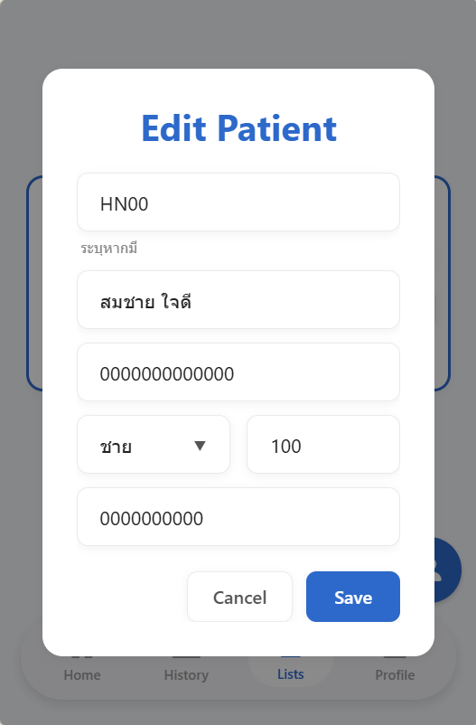 
</p>

- **หน้า Profile**
<p align="left">
  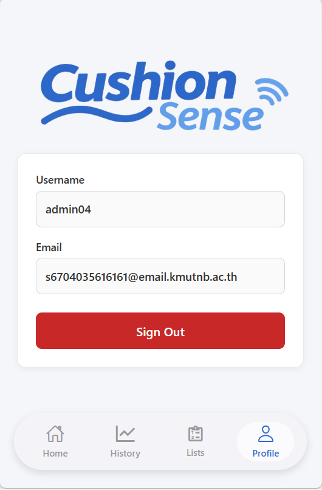 
</p>

## ลิงก์วิดีโอสาธิต

- **Application Demo :** [View Demo](https://drive.google.com/drive/folders/1LP2dTaQM2SBASmU5PQ7SS64SlfZR-aRl?usp=sharing)

## ข้อจำกัด

**ข้อจํากัดด้านฮาร์ดแวร์และ IoT**

- ความเสถียรของระบบเครือข่ายไร้สายที่ต้องใช้เชื่อมต่อระหว่างไมโครคอนโทรลเลอร์ ESP32 และแอปพลิเคชัน ในสภาวะแวดล้อมที่มีผู้ใช้งานหนาแน่น อาจเกิดความหน่วง ดีเลย์หรือสัญญาณขาดหาย
- ข้อจํากัดของเซนเซอร์แรงกดที่อาจไม่สามารถครอบคลุมทั่วทั้งเบาะรองนั่งได้

**ข้อจํากัดด้านซอฟต์แวร์และการจัดการข้อมูล**

- การประมวลผลข้อมูลแบบ Real-time หากเกิดการส่งสัญญาณข้อมูลจากเซนเซอร์ด้วยความถี่ที่สูงเกินไป อาจทําให้ระบบเกิดอาการหน่วง กระตุกหรืออุปกรณ์มีอุณหภูมิสูงขึ้น จึงควรกําหนดความถี่ในการส่งข้อมูลให้เหมาะสม
- สัญญาณรบกวนของข้อมูลค่าความชื้น อุณหภูมิ และแรงกด อาจเกิดการผันผวนจากปัจจัยแวดล้อมภายนอก

**ข้อจํากัดด้านบริบททางการแพทย์และความปลอดภัย**

- ขอบเขตการวินิจฉัยโรคของระบบและเซนเซอร์ที่เลือกใช้ ไม่สามารถยืนยันหรือวินิจฉัยการเกิดโรคแผลกดทับได้อย่างแม่นยํา 100% จึงควรระบุอย่างชัดเจนว่า แอปพลิเคชันนี้เป็นเพียงระบบต้นแบบเพื่อการศึกษา ไม่สามารถใช้ทดแทนการวินิจฉัยหรือการรักษาทางการแพทย์ได้

## แนวทางการพัฒนาต่อในอนาคต

- เพิ่มจำนวน Sensor เพื่อให้ครอบคลุมพื้นที่เบาะมากขึ้น
- เพิ่มระบบวิเคราะห์ข้อมูลเพื่อประเมินความเสี่ยง
- เพิ่มระบบแจ้งเตือนผ่าน Notification
- ปรับปรุงระบบให้รองรับผู้ใช้งานจำนวนมากขึ้น

## คำชี้แจงการใช้งานอย่างรับผิดชอบ

Cushion Sense เป็นระบบที่พัฒนาขึ้นเพื่อช่วยติดตามและเฝ้าระวังข้อมูลแรงกดและความชื้นบริเวณเบาะรองนั่งรถเข็น ขอบเขตการวินิจฉัยโรคของระบบและเซนเซอร์ที่เลือกใช้ ไม่สามารถยืนยันหรือวินิจฉัยการเกิดโรคแผลกดทับได้อย่างแม่นยํา 100% ข้อมูลและการแจ้งเตือนจากระบบมีวัตถุประสงค์เพื่อช่วยสนับสนุนการเฝ้าระวังเท่านั้น ไม่ควรใช้แทนการวินิจฉัยหรือการรักษาทางการแพทย์ ผู้ใช้งานควรพิจารณาข้อมูลจากระบบร่วมกับสภาพร่างกายและคำแนะนำของบุคลากรทางการแพทย์
